# Effects
{: .no_toc }

  

    Table of contents
  

  {: .text-delta }
1. TOC
{:toc}

## Distortion/Saturation

### [Pisstortion](https://vst.unplug.red/pisstortion) by [unplugred](https://vst.unplug.red) *(free/paid) [[open source](https://github.com/unplugred/vsts)]*
{: .no_toc }
> 
> 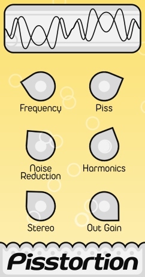
> 
> a very fun sine fold distortion plugin :)

[Get](https://vst.unplug.red/pisstortion){: .btn .btn-blue }
[Support](https://www.patreon.com/unplugred){: .btn .btn-outline }

### [PREDD](https://www.patreon.com/posts/predd-57672680) by [Analog Obsession](https://www.patreon.com/analogobsession) *(free/donation)*
{: .no_toc }
> 
> 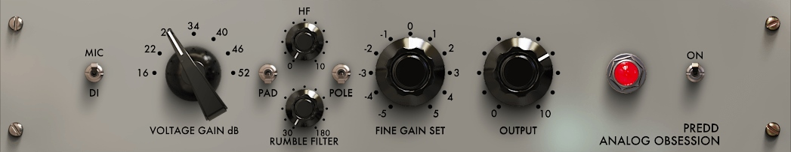
> 
> Throw this on the drum bus and watch your high hats go brrr, I cannot get over how good this plugin sounds.

[Get](https://www.patreon.com/posts/predd-57672680){: .btn .btn-blue }
[Support](https://www.patreon.com/analogobsession){: .btn .btn-outline }

### [MackEQ](https://www.airwindows.com/mackeq/) by [airwindows](https://www.patreon.com/airwindows) *(free/donation)*
{: .no_toc }
> 
> 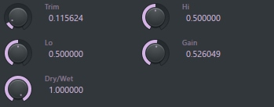
> 
> This plugin will FLATTEN your sound, I probably use it more than I should.
> 
> **[▶ Demo video](https://www.youtube.com/watch?v=MH_rkK4keB8)**

[Get](https://www.airwindows.com/mackeq/){: .btn .btn-blue }
[Support](https://www.patreon.com/airwindows){: .btn .btn-outline }

### [Prisma](https://vst.unplug.red/prisma) by [unplugred](https://vst.unplug.red) *(free/paid) [[open source](https://github.com/unplugred/vsts)]*
{: .no_toc }
> 
> 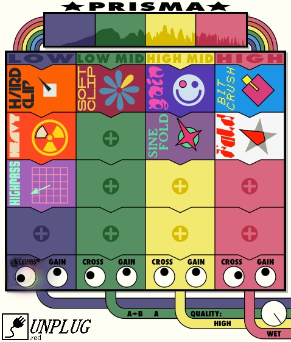
> 
> Multiband distortion with lots of algorhithms.

[Get](https://vst.unplug.red/prisma/){: .btn .btn-blue }
[Support](https://www.patreon.com/unplugred){: .btn .btn-outline }

### [PeakEater](https://github.com/vvvar/PeakEater) by [Vladyslav Voinov](https://github.com/vvvar) *(free) [[open source](https://github.com/vvvar/PeakEater)]*
{: .no_toc }
> 
> 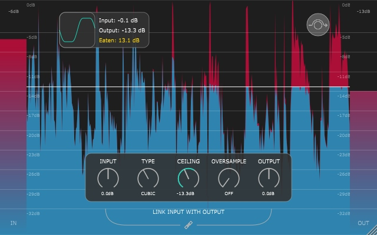
> 
> I got this one very recently but it does its job very well, nothing new, it's basically a hard/soft clipper with the option to oversample but the ui makes it very quick and efficient to use.

[Get](https://github.com/vvvar/PeakEater/releases){: .btn .btn-blue }

### [More](https://modsound.co/freebies) by [Mod Sound](https://modsound.co/) *(free)*
{: .no_toc }
> 
> 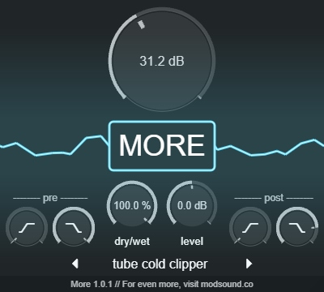
> 
> This one goes brrr aswell, I use almost exclusively the tube cold clipper mode.

[Get](https://modsound.co/freebies){: .btn .btn-blue }

### [SeededBandFuzz](https://archive.org/download/cybergrunge-plugins) by [cybergrunge.net](https://cybergrunge.net/) *(free)*
{: .no_toc }
> 
> 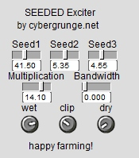
> 
> This is a black box where you just tweak the seed numbers and a mangled chewed up digested and spit out sound will come out. *maybe* it'll sound like what you put in, but it probably won't. very cool >:)

[Get](https://cybergrunge.net/resources/vst/SeededBandFuzz.dll){: .btn .btn-blue }

### [Codec](https://lese.io/plugin/codec/) by [Lese](https://lese.io/) *(free)*
{: .no_toc }
> 
> 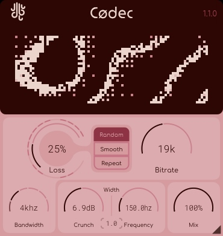
> 
> Sound degradation plugin with a sound that's quite different from most bitcrushers.

[Get](https://lese.io/plugin/codec/){: .btn .btn-blue }

## Modulation (Chorus/Flanger/Phaser)

### [EsPhaser](https://github.com/ryukau/VSTPlugins/releases) by [Uhhyou](https://ryukau.github.io/VSTPlugins/) *(free) [[open source](https://github.com/ryukau/VSTPlugins)]*
{: .no_toc }
> 
> 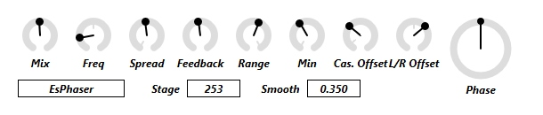
> 
> Probably my most used plugin, it is extremely good for spatialization and generally making your sounds sound more alive and w i d e.

[Get](https://github.com/ryukau/VSTPlugins/releases){: .btn .btn-blue }
[Support](https://www.paypal.com/paypalme/ryukau){: .btn .btn-outline }

### [LongPhaser](https://github.com/ryukau/VSTPlugins/releases) by [Uhhyou](https://ryukau.github.io/VSTPlugins/) *(free) [[open source](https://github.com/ryukau/VSTPlugins)]*
{: .no_toc }
> 
> 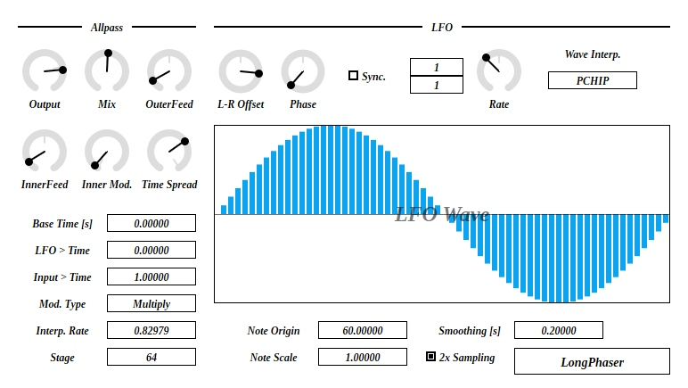
> 
> Pretty similar to EsPhaser but more subtle (the amount of stages is limited to 64) but it's still very good for the same things, I would actually put this one on vocals.

[Get](https://github.com/ryukau/VSTPlugins/releases){: .btn .btn-blue }
[Support](https://www.paypal.com/paypalme/ryukau){: .btn .btn-outline }

### [Valhalla Space Modulator](https://valhalladsp.com/shop/modulation/valhalla-space-modulator/) by [Valhalla](https://valhalladsp.com/) *(free)*
{: .no_toc }
> 
> 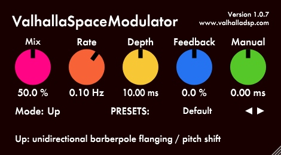
> 
> This is an obvious one but it's free and does the job pretty well so I thought I'd include it here.

[Get](https://valhalladsp.com/shop/modulation/valhalla-space-modulator/){: .btn .btn-blue }

### [Diopser](https://nightly.link/robbert-vdh/nih-plug/workflows/build/master) by [Robbert van der Helm](https://github.com/robbert-vdh) *(free) [[open source](https://github.com/robbert-vdh/nih-plug)]*
{: .no_toc }
> 
> 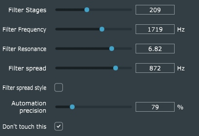
> 
> This will make anything sound like a lazer and go bwee bwoo it's very nice and cool sometimes hehe

[Get](https://nightly.link/robbert-vdh/nih-plug/workflows/build/master){: .btn .btn-blue }
[Support](https://liberapay.com/robbert-vdh){: .btn .btn-outline }
[Support (paypal)](https://www.paypal.com/paypalme/robbertvdh){: .btn .btn-outline }

## Reverb

### [AriesVerb v0.4a](http://ariescode.com/ariesverb/ariesverb-archive) by [AriesCode](http://ariescode.com/) *(free)*
{: .no_toc }
> 
> 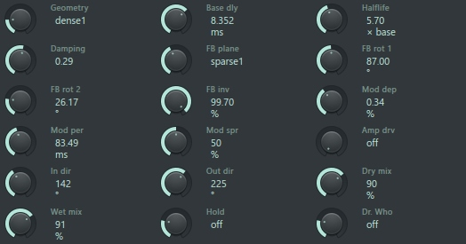
> 
> This is an alpha version of AriesVerb (which is probably my favorite reverb), this version has less features but the same extremely clean fdn sound, it can go to super short lengths to give you very resonant rooms, very very good for sound design of all kinds.

[Get](http://ariescode.com/ariesverb/ariesverb-archive){: .btn .btn-blue }

### [LatticeReverb](https://github.com/ryukau/VSTPlugins/releases) by [Uhhyou](https://ryukau.github.io/VSTPlugins/) *(free) [[open source](https://github.com/ryukau/VSTPlugins)]*
{: .no_toc }
> 
> 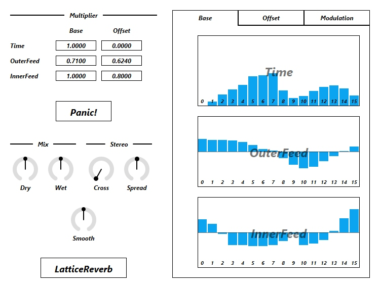
> 
> A very cool reverb, with a sound that's hard to match with anything else.

[Get](https://github.com/ryukau/VSTPlugins/releases){: .btn .btn-blue }
[Support](https://www.paypal.com/paypalme/ryukau){: .btn .btn-outline }

### [Giant Verb](https://sites.google.com/site/digitalsystemic/home/giant-verb) by [Digital Systemic](https://sites.google.com/site/digitalsystemic/) *(free)*
{: .no_toc }
> 
> 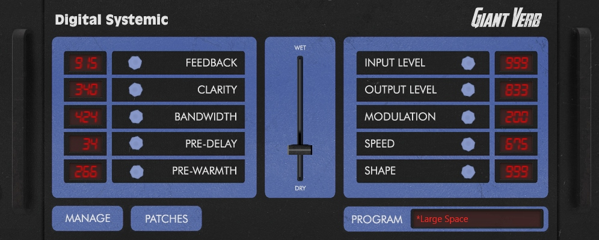
> 
> Probably the best sounding free "normal" (as in not weird/specific) reverb I have found. Just perfect for vocals :)

[Get](https://sites.google.com/site/digitalsystemic/home/giant-verb){: .btn .btn-blue }

### [FDN64Reverb](https://github.com/ryukau/VSTPlugins/releases) by [Uhhyou](https://ryukau.github.io/VSTPlugins/) *(free) [[open source](https://github.com/ryukau/VSTPlugins)]*
{: .no_toc }
> 
> 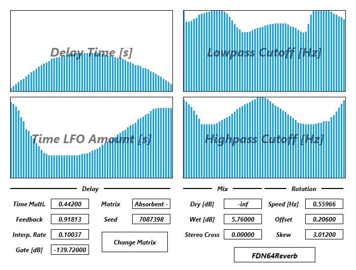
> 
> This is a HEAVY plugin (uses 50% of my cpu all on its own) BUT it will give you reverb sounds like no other plugins can. Amazing for spoken voices and ambient stuff. Highly suggest you bake whatever you use it on and then disable it.

[Get](https://github.com/ryukau/VSTPlugins/releases){: .btn .btn-blue }
[Support](https://www.paypal.com/paypalme/ryukau){: .btn .btn-outline }

## Spectral plugins (that means they use [FFT](https://en.wikipedia.org/wiki/Fast_Fourier_transform))

### [Spectral Compressor](https://nightly.link/robbert-vdh/nih-plug/workflows/build/master) by [Robbert van der Helm](https://github.com/robbert-vdh) *(free) [[open source](https://github.com/robbert-vdh/nih-plug)]*
{: .no_toc }
> 
> 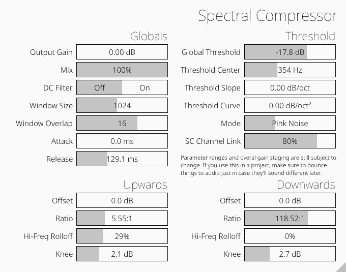
> 
> This is like OTT but with a crazy amount of bands. absolutely crazy plugin, you can use it to bring out the best or the worst in your sounds I love it.
> 
> **⚠This plugin can get a bit crazy so please put a limiter after it for your first few times playing with it, don't damage your ears or your speakers!!!**

[Get](https://nightly.link/robbert-vdh/nih-plug/workflows/build/master){: .btn .btn-blue }
[Support](https://liberapay.com/robbert-vdh){: .btn .btn-outline }
[Support (paypal)](https://www.paypal.com/paypalme/robbertvdh){: .btn .btn-outline }

### [Spectral Gate](https://www.andrewreeman.com/spectralsuite/) by [Andrew Reeman](https://github.com/andrewreeman) *(free) [[open source](https://github.com/andrewreeman/SpectralSuite)]*
{: .no_toc }
> 
> 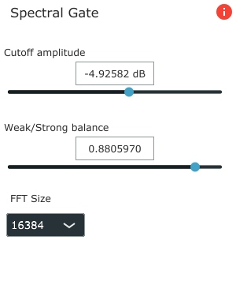
> 
> This plugin will individually gate each fft """band""" which means it will generally get rid of "noise" in most sounds but it can be used for soooo much in terms of sound design, higher fft sizes will make your sounds all swooshy and lower ones sound like some kind of alien compression artefact it's very cool.
> 
[**▶ Demo Video**](https://youtu.be/PxL0OAgxjAY)

[Get](https://www.andrewreeman.com/spectralsuite/){: .btn .btn-blue }

### [Corkscrew](https://plugins4free.com/plugin/1867/) by Anarchy Sound Software (free)
{: .no_toc }
> 
> 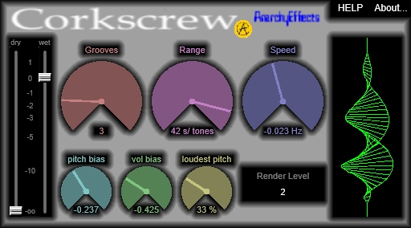
> 
> I could not tell you what this plugin exactly does but it ends up sounding like some sort of extreme flanger/phaser. It sounds super cool on drums and non-tonal sounds, especially when you don't turn the grooves too high.

[Get](https://plugins4free.com/plugin/1867/){: .btn .btn-blue }

### [Phase Lock](https://www.andrewreeman.com/spectralsuite/) by [Andrew Reeman](https://github.com/andrewreeman) *(free) [[open source](https://github.com/andrewreeman/SpectralSuite)]*
{: .no_toc }
> 
> 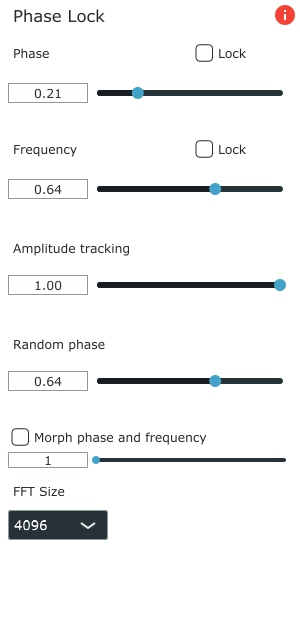
> 
> I use this one mostly for the random phase slider, it will make your stuff v e r y  w i d e.
> 
[**▶ Demo video**](https://youtu.be/qGX1eLIMen0)

[Get](https://www.andrewreeman.com/spectralsuite/){: .btn .btn-blue }

### [Bin Scrambler](https://www.andrewreeman.com/spectralsuite/) by [Andrew Reeman](https://github.com/andrewreeman) *(free) [[open source](https://github.com/andrewreeman/SpectralSuite)]*
{: .no_toc }
> 
> 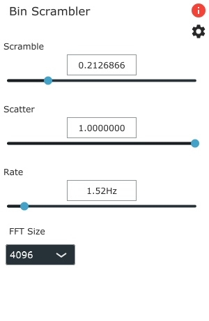
> 
> This is a very cool effect, it takes each fft "band" and frequency shifts it at random.
> 
[**▶ Demo video**](https://youtu.be/jHky7Vbqz6U)

[Get](https://www.andrewreeman.com/spectralsuite/){: .btn .btn-blue }

## Granular

### [Argotlunar](https://github.com/mourednik/argotlunar) by [mourednik](https://github.com/mourednik) *(free) [[open source](https://github.com/mourednik/argotlunar)]*
{: .no_toc }
> 
> 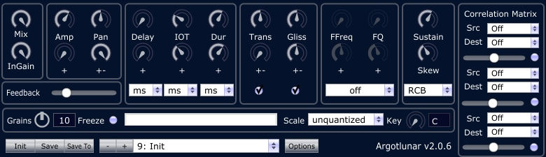
> 
> A pretty cool granular delay where you can randomize the pitch start/end of each grain.

[Get](https://mourednik.github.io/argotlunar/#download){: .btn .btn-blue }

### [JG-Granular](https://github.com/szkkng/jg-granular/releases) by [Kengo](https://github.com/szkkng) *(free) [[open source](https://github.com/szkkng/jg-granular)]*
{: .no_toc }
> 
> 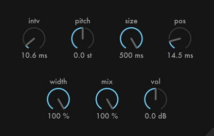
> 
> Fairly basic granular plugin but still very very useful

[Get](https://github.com/szkkng/jg-granular/releases){: .btn .btn-blue }

## Panning/Spatialization/Stereo Width

### [PSY PAN Pro](https://www.apollobeatz.ru/psypan/index_eng.html) by [Apollo Beatz](https://www.apollobeatz.ru/) *(free/donation)*
{: .no_toc }
> 
> 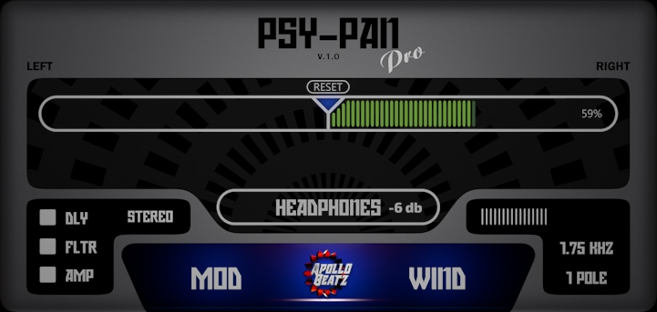
> 
> A psychoacoustic panning tool that's very simple but effective, has some very welcome modulation options too :)

[Get](https://plugins4free.com/plugin/3849/){: .btn .btn-blue }

### [Phantom Center](https://www.bertomaudio.com/phantom-center.html) by [Bertom](https://www.bertomaudio.com/) *(Pay-what-you-want)*
{: .no_toc }
> 
> 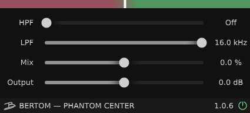
> 
> This plugin lets you extract the true "mid" channel of your sound and turn it up or down. Very useful

[Get](https://www.bertomaudio.com/phantom-center.html){: .btn .btn-blue }

### [Space 360](https://www.kvraudio.com/product/space360-by-cytosonic) by [Cyto Sonic](https://www.kvraudio.com/developer/cytosonic) *(free)*
{: .no_toc }
> 
> 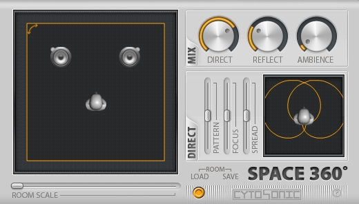
> 
> A nice simple spatialization plugin that lets you place the left and right channel independently. Something that took me a while to notice is that the text under the knobs are actually tabs (look here:)
> 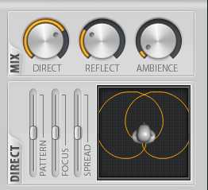

[Get](https://www.kvraudio.com/product/space360-by-cytosonic/downloads){: .btn .btn-blue }

### [Panning Room](https://www.facebook.com/Yriisem/posts/pfbid07cf4EcFVf6TzWffBPRBKrXYkdEAdboza8pADHAsUB1sGPgRosuUBZZFwVu5qHgvXl) by [Yuri Semenov](https://www.facebook.com/Yriisem/) *(free/donation)*
{: .no_toc }
> 
> 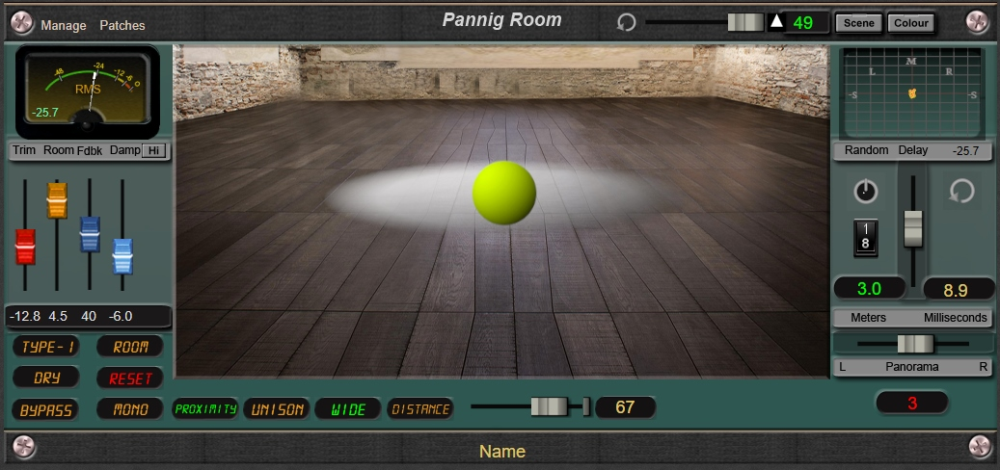
> 
> Another spatialization plugin, this one lets you visually place a sound in a room and give it "fake" width, it has a very nice sound. Only thing I wish it did is let you put sounds behind the listener, but still very good and fun to play with!!!
> 
> **[▶ Demo video](https://youtu.be/LGIGBfR0ie4)**

[Get](https://drive.google.com/file/d/13HBo9A6cnrj2PGr3fAEZ7hqQ5cmD3Fbw/view){: .btn .btn-blue }

### [Sweep](https://lese.io/plugin/sweep/) by [Lese](https://lese.io/) *(free)*
{: .no_toc }
> 
> 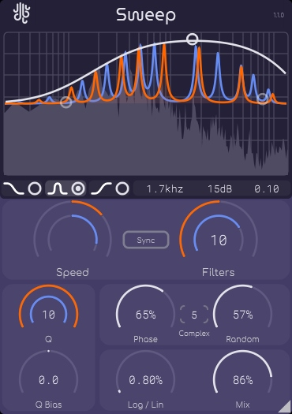
> 
> This is technically a filter plugin but I didn't have a category for that so I thought I'd put it here since it does provide some width enhancing things. It creates a bunch of notches that move up or down like a doppler sound, similar to Izotope mobius filter if you have tried that.

[Get](https://lese.io/plugin/sweep/){: .btn .btn-blue }

## Dynamics

### [Specomp](https://www.patreon.com/posts/specomp-51285294) by [Analog Obsession](https://www.patreon.com/analogobsession) *(free)*
{: .no_toc }
> 
> 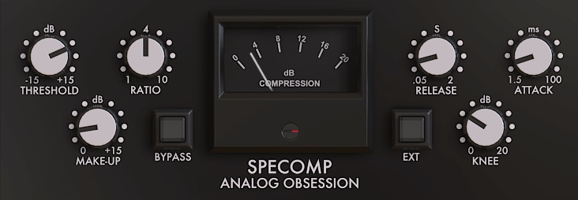
> 
> Just a very nice and snappy compressor for drums :)

[Get](https://www.patreon.com/posts/specomp-51285294){: .btn .btn-blue }
[Support](https://www.patreon.com/analogobsession){: .btn .btn-outline }