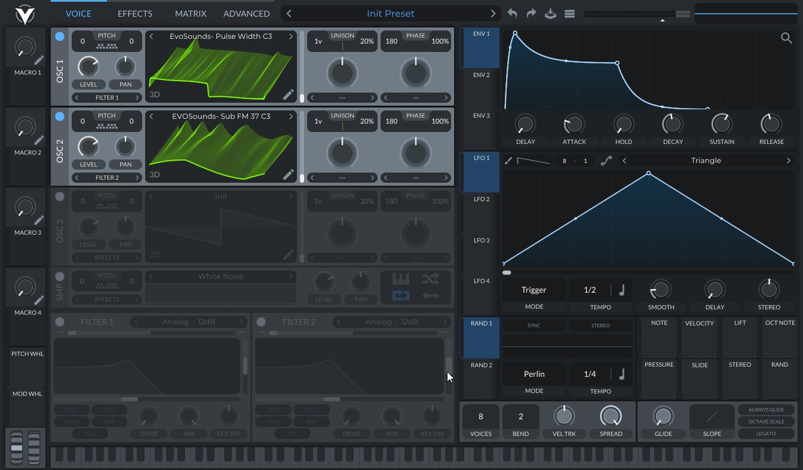
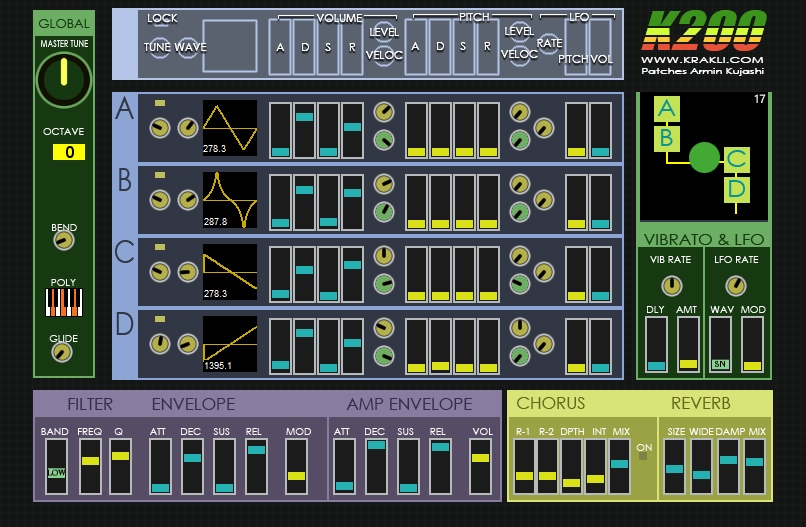
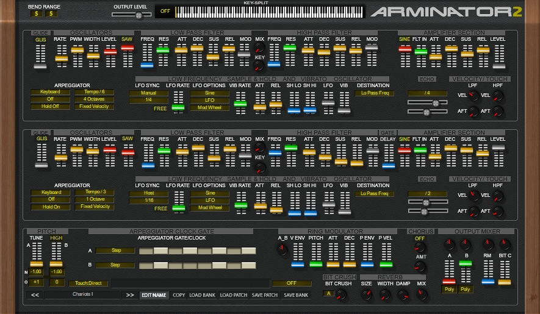
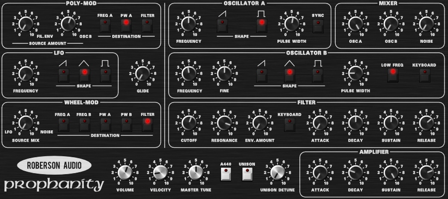
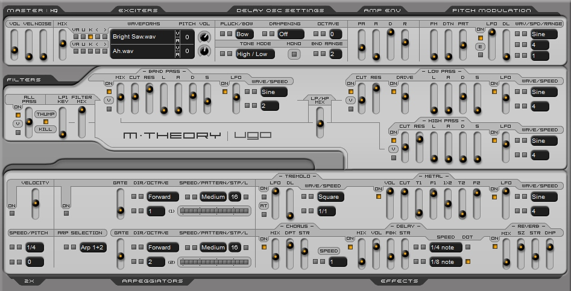

# Generators
{: .no_toc }

  

    Table of contents
  

  {: .text-delta }
1. TOC
{:toc}

## Modern(digital-sounding) Synths

### [**Vital**](https://vital.audio/) by [Matt Tytel](https://www.instagram.com/matttytel) *(free/paid)*
{: .no_toc }
> 
> 
> 
> A very capable wavetable synth, extremely similar to Serum.

[Get](https://vital.audio/#getvital){: .btn .btn-blue target="_blank"}
[Support](https://account.vital.audio/subscribe){: .btn .btn-outline target="_blank"}

### [**K200**](https://www.krakliplugins.com/k200) by [Krakli Software](https://www.krakliplugins.com/) *(free)*
{: .no_toc }
> 
> 
> 
> 4 operator FM synthesizer with some pretty cool sounds.

[Get](https://www.krakliplugins.com/k200){: .btn .btn-blue target="_blank"}
[Support](https://www.krakliplugins.com/){: .btn .btn-outline target="_blank"} (Donate button at the bottom)

## Vintage/Analog Emulation Synths

### [**Arminator 2**](https://www.krakliplugins.com/arminator-2) by [Krakli Software](https://www.krakliplugins.com/) *(free)*
{: .no_toc }
> 
> 
> 
> An emulation of the Yamaha CS80, capable of absolutely beautiful sounds.

[Get](https://www.krakliplugins.com/arminator-2){: .btn .btn-blue target="_blank"}
[Support](https://www.krakliplugins.com/){: .btn .btn-outline target="_blank"} (Donate button at the bottom)

### [**Prophanity**](https://www.robersonaudio.com/vintage-synth-collection.html) by [Roberson Audio](https://www.robersonaudio.com/) *(free)*
{: .no_toc }
> 
> 
> 
> An emulation of the Sequential Prophet 5.

[Get](https://plugins4free.com/plugin/778/){: .btn .btn-blue target="_blank"}

## Physical Modeling Synths

### [**M-theory**](https://plugins4free.com/plugin/1901/) by [Ugo Audio](http://www.ugoaudio.com/) *(free)*
{: .no_toc }
> 
> 
> 
> //Todo

[Get](https://plugins4free.com/plugin/1901/){: .btn .btn-blue target="_blank"}